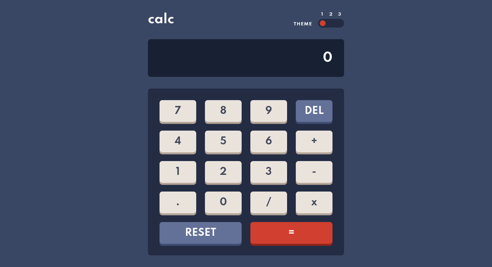

# Frontend Mentor - Calculator app solution

This is a solution to the [Calculator app challenge on Frontend Mentor](https://www.frontendmentor.io/challenges/calculator-app-9lteq5N29). Frontend Mentor challenges help you improve your coding skills by building realistic projects. 

## Table of contents

- [Overview](#overview)
  - [The challenge](#the-challenge)
  - [Screenshot](#screenshot)
  - [Links](#links)
- [My process](#my-process)
  - [Built with](#built-with)
  - [What I learned](#what-i-learned)
  - [Useful resources](#useful-resources)
- [Author](#author)

## Overview

### The challenge

Users should be able to:

- See the size of the elements adjust based on their device's screen size
- Perform mathmatical operations like addition, subtraction, multiplication, and division
- Adjust the color theme based on their preference
- **Bonus**: Have their initial theme preference checked using `prefers-color-scheme` and have any additional changes saved in the browser

### Screenshot



### Links

- Solution URL: [https://github.com/NDOY3M4N/calculator-app](https://github.com/NDOY3M4N/calculator-app)
- Live Site URL: [https://ndoy3m4n.github.io/calculator-app/](https://ndoy3m4n.github.io/calculator-app/)

## My process

### Built with

- Semantic HTML5 markup
- CSS custom properties
- Flexbox
- CSS Grid
- Mobile-first workflow
- Vanilla JavaScript

### What I learned

I learned how to detect the user's color preference scheme in JavaScript with `window.matchMedia`.

```js
const lightTheme = window.matchMedia('(prefers-color-scheme: light)').matches
```
This will return `true` if light mode is enabled.

### Useful resources

- [How to detect dark mode using JavaScript](https://flaviocopes.com/javascript-detect-dark-mode/) - This article explains how to use `matchMedia` to detect dark/light mode

## Author

- Frontend Mentor - [@NDOY3M4N](https://www.frontendmentor.io/profile/NDOY3M4N)
- Twitter - [@NDOY3M4N](https://www.twitter.com/NDOY3M4N)
